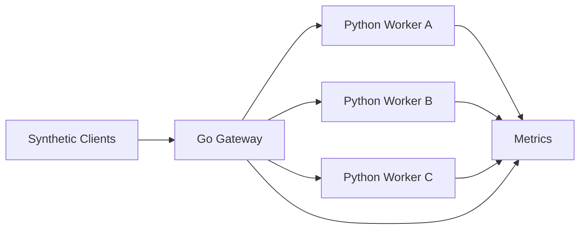

# LLM Inference API Gateway & Cluster Orchestration

Distributed systems project focused on scalable inference routing, cluster orchestration, and fault tolerance. The system simulates an LLM-serving platform with a Go-based API gateway, Python worker nodes, containerized local deployment, and a Kubernetes-ready architecture for later phases.

## Why This Project

This repository is being built to demonstrate practical distributed systems skills:

- concurrency and backpressure in Go
- compute-aware request routing instead of naive round-robin balancing
- worker orchestration with Docker and Kubernetes
- failure handling, retries, and recovery behavior
- observability and benchmark-driven validation

## Target Resume Narrative

- Architected a high-throughput inference gateway in Go using Goroutines, bounded queues, and asynchronous dispatch to process large volumes of simulated LLM requests.
- Orchestrated a fault-tolerant microservices cluster with Docker and Kubernetes, deploying multiple Python worker nodes that simulate batching, token generation latency, and heterogeneous GPU capacity.
- Engineered a dynamic routing strategy based on sequence length, queue pressure, and worker capacity rather than standard HTTP load balancing.
- Validated resilience under burst traffic and worker failure through synthetic stress testing and recovery experiments.

## System Overview

The platform is split into a small set of focused services:

- `gateway/`: Go API gateway that accepts inference requests, estimates request cost, and routes work to workers
- `worker/`: Python service that simulates text generation latency and reports worker capacity
- `deploy/docker/`: local multi-service deployment assets
- `deploy/k8s/`: Kubernetes manifests for later phases
- `tests/stress/`: synthetic load generation and resilience scenarios
- `docs/`: architecture, concepts, and benchmark notes

Current phase status:

- Phase 1: repository scaffold, working gateway, worker simulator, local Docker setup
- Phase 2: bounded queues, concurrency controls, request buffering, and overload rejection
- Phase 3: cached worker-state routing and compute-aware scheduling
- Phase 4: Kubernetes deployment, health probes, and failover drills
- Phase 5: observability, dashboards, benchmark runs, and polished GitHub presentation

## Architecture



Request flow in the current phase:

1. Client sends an inference request to the gateway.
2. Gateway validates the request and attempts to place it into a bounded in-memory admission queue.
3. A dispatcher goroutine pulls work from the queue and estimates request cost from prompt length and token budget.
4. The router scores workers using a periodically refreshed capacity cache instead of probing every worker on every request.
5. Worker simulates batching and generation delay, then returns a synthetic completion.
6. Gateway exposes queue and router-state statistics through a lightweight stats endpoint.

Later phases add:

- richer heartbeats and stale-worker eviction
- failure-aware retries
- Prometheus metrics and Grafana dashboards
- Kubernetes deployment and scaling behavior

## What Makes This A Distributed Systems Project

The value is not in calling an LLM API. The value is in the control plane decisions around the request path:

- how the gateway behaves during overload
- how work is distributed across uneven worker capacity
- how failures are detected and isolated
- how latency and throughput change under bursty traffic
- how the system preserves stability during partial outages

## Repository Layout

```text
.
|-- docs/
|   `-- architecture.md
|   `-- concepts.md
|-- gateway/
|   |-- cmd/server/main.go
|   |-- go.mod
|   `-- internal/
|       |-- config/config.go
|       |-- router/router.go
|       `-- types/types.go
|-- worker/
|   |-- app/main.py
|   `-- requirements.txt
|-- deploy/
|   |-- docker/
|   |   |-- Dockerfile.gateway
|   |   |-- Dockerfile.worker
|   |   `-- docker-compose.yml
|   `-- k8s/
`-- tests/
    `-- stress/
```

## Phase Plan

### Phase 1: Service Skeleton and GitHub-Ready Documentation

Goals:

- stand up a working Go gateway
- stand up a worker simulator in Python
- make the project understandable in under two minutes from the README
- provide a local multi-container run path

Deliverables:

- gateway `/healthz` and `/infer`
- worker `/healthz`, `/capacity`, and `/generate`
- least-loaded routing based on live worker capacity responses
- Docker Compose setup for local multi-worker runs
- architecture and phase plan documentation that explains why the system exists

### Phase 2: Concurrency and Backpressure

Goals:

- move from direct forwarding to buffered admission control
- prevent overload from collapsing the gateway
- make queue behavior visible so benchmark results are easy to explain

Deliverables:

- bounded request queues
- worker dispatch pools
- timeout and cancellation handling
- basic load shedding strategy
- gateway stats endpoint for queue depth, in-flight requests, and rejection counts
- a benchmark scenario that can force queue saturation on demand

### Phase 3: Compute-Aware Scheduling

Goals:

- make routing decisions based on estimated request cost and worker saturation
- replace per-request live probing with a more realistic worker-state control loop

Deliverables:

- request cost model from prompt length and token target
- periodic worker-state cache with staleness windows
- richer routing heuristic than "least loaded"
- side-by-side comparison against round robin

### Phase 4: Kubernetes and Failure Recovery

Goals:

- package and orchestrate the system as a resilient cluster
- prove service behavior during pod restarts and worker loss

Deliverables:

- Kubernetes manifests
- readiness and liveness probes
- worker failure simulation
- retry/failover behavior validation

### Phase 5: Benchmarking and Polish

Goals:

- produce resume-ready evidence
- leave behind a GitHub repo that communicates the engineering decisions quickly

Deliverables:

- repeatable stress tests
- throughput and latency charts
- recovery-time measurements
- architecture diagrams and benchmark write-up

## Local Development

### Option 1: Run With Docker Compose

```bash
docker compose -f deploy/docker/docker-compose.yml up --build
```

Gateway:

- `http://localhost:8080/healthz`
- `http://localhost:8080/infer`
- `http://localhost:8080/stats`

### Option 2: Run Services Directly

Gateway:

```bash
cd gateway
go run ./cmd/server
```

From the repository root, this also works:

```bash
go run ./gateway/cmd/server
```

Worker:

```bash
cd worker
pip install -r requirements.txt
uvicorn app.main:app --host 0.0.0.0 --port 9001
```

## Example Request

```bash
curl -X POST http://localhost:8080/infer \
  -H "Content-Type: application/json" \
  -d "{\"prompt\":\"Explain bounded queues in distributed systems.\",\"max_tokens\":128}"
```

Example response:

```json
{
  "worker_id": "worker-a",
  "output": "Simulated completion for prompt length 45 and max_tokens 128.",
  "latency_ms": 723
}
```

Example stats response:

```json
{
  "queue_depth": 0,
  "queue_capacity": 256,
  "dispatch_workers": 32,
  "in_flight": 1,
  "accepted_requests": 42,
  "completed_requests": 41,
  "rejected_requests": 0,
  "failed_requests": 0,
  "router": {
    "refresh_interval_ms": 1500,
    "stale_after_ms": 5000,
    "cached_workers": 3,
    "healthy_workers": 3
  }
}
```

## Success Criteria

By the end of this build, the repository should show:

- thoughtful service boundaries
- evidence of concurrency control
- routing logic tied to compute cost
- resilience under worker failure
- real metrics and benchmark artifacts

Each phase should also leave behind three visible artifacts:

- a runnable behavior
- a measurable system property
- a README or docs update that explains the design tradeoff

The running design rationale lives in [docs/concepts.md](C:/Users/sidda/projects/API-Gateway-Cluster-Orchestration/docs/concepts.md), which is updated as each phase lands.

## Current Focus

The gateway now has a bounded queue, asynchronous dispatch path, and cached worker-state routing. The next engineering milestone is adding richer worker heartbeats, benchmark comparisons against round robin, and then carrying that behavior into Kubernetes failure testing.
